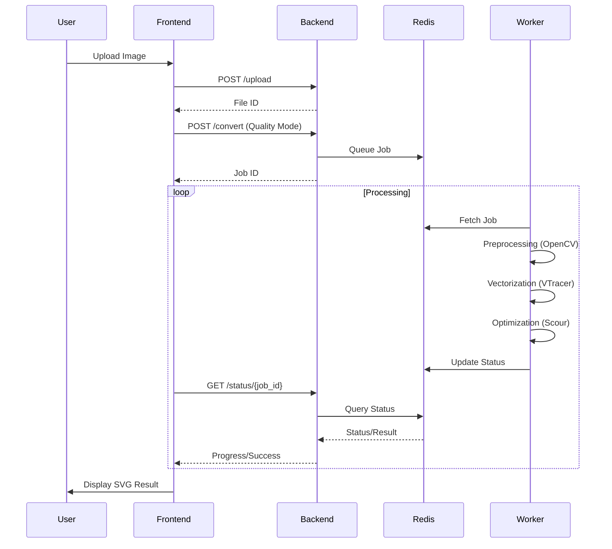

# 🎨 Auto Trace

[](https://opensource.org/licenses/MIT)
[](https://www.python.org/downloads/)
[](https://nextjs.org/)
[](https://fastapi.tiangolo.com/)
[](https://www.docker.com/)

> **A production-grade raster-to-vector conversion platform featuring three quality tiers, advanced preprocessing, async processing, and a modern web interface.**

---

## 📑 Table of Contents

- [✨ Features](#-features)
- [🏗️ Architecture](#️-architecture)
- [🚀 Quick Start](#-quick-start)
- [💻 CLI Usage](#-cli-usage)
- [🌐 API Usage](#-api-usage)
- [🛠️ Tech Stack](#️-tech-stack)
- [📚 Documentation](#-documentation)

---

## ✨ Features

### 🎛️ Quality Modes

| Mode | Preprocessing | SVG Optimization | Time | File Size | Best For |
|------|--------------|------------------|------|-----------|----------|
| **Fast** | None | Light | < 1s | 30-50KB | Simple graphics, clean images |
| **Standard** | Color reduction + Bilateral denoise + CLAHE | Standard | 1-3s | 20-40KB | Most images, photos |
| **High** | Standard + NLM + Sharpen + Edge enhancement | Aggressive | 3-10s | 15-30KB | Complex images, professional work |

### 🔬 Advanced Image Preprocessing
- **Color Reduction**: K-means clustering, Median cut (8-256 colors)
- **Noise Reduction**: Gaussian, Bilateral, NLM, Median filters
- **Contrast Enhancement**: CLAHE, Histogram equalization, Levels, Sigmoid
- **Sharpening & Edges**: Unsharp mask, Laplacian, Sobel, Scharr operators
- **Monochrome & Dithering**: Otsu, Adaptive, Floyd-Steinberg, Bayer, Atkinson

### 📉 SVG Optimization
- **Light**: Remove metadata and comments
- **Standard**: Scour optimization (path simplification, ID shortening)
- **Aggressive**: Standard + color optimization + number rounding + minification

### 📊 Quality Analysis
Provides deep metrics like **Edge Preservation Score (IoU)**, **SSIM**, **MSE**, **PSNR**, and **Histogram Correlation**.

### 💻 Modern Web Interface
- **Drag & Drop Upload**: Streamlined user experience
- **Real-time Progress**: Track Celery job conversions live
- **Quality Comparison**: Visual side-by-side comparison of different modes
- **Responsive**: Fully optimized for desktop, tablet, and mobile viewing

### ⚙️ Powerful API
- **Async Processing**: Driven by Celery & Redis
- **Batch Processing**: Parallelize multiple conversions
- **AI Recommendations**: Get the best mode recommended instantly

---

## 🏗️ Architecture

### System Flow


### Conversion Pipeline



---

## 🚀 Quick Start

### Prerequisites
- **Python 3.11+**
- **Node.js 18+**
- **Redis 7+**

### Development Setup

```bash
# Clone repository
git clone https://github.com/mrigankad/RastertoSVG.git
cd RastertoSVG

# Setup Python environment
cd backend
python -m venv venv
source venv/bin/activate  # Windows: venv\Scripts\activate
pip install -r requirements.txt

# Setup Frontend
cd ../frontend
npm install
```

### Run with Docker Compose (Recommended)

```bash
# Start all core services
docker-compose up -d

# Start with full monitoring (Prometheus, Grafana, Flower)
docker-compose --profile monitoring up -d
```

### Access Points
- **Frontend**: `http://localhost:3000`
- **API**: `http://localhost:8000`
- **API Docs**: `http://localhost:8000/docs`
- **Flower (Celery)**: `http://localhost:5555`
- **Prometheus / Grafana**: `http://localhost:9090` / `http://localhost:3001`

---

## 💻 CLI Usage

Auto Trace comes with a rich Command Line Interface for direct local usage.

```bash
# Convert single image
python -m backend.app.cli convert input.png -o output.svg --quality standard

# Batch convert an entire directory
python -m backend.app.cli batch ./input-dir -o ./output-dir --quality standard

# Run an automated quality comparison
python -m backend.app.cli compare input.png --output ./comparison

# Get AI-based quality recommendations
python -m backend.app.cli recommend input.png
```

---

## 🌐 API Usage

Easily integrate Auto Trace into your own applications using Python or direct HTTP calls.

### Python Client Example
```python
from examples.api_client import RasterToSVGClient

client = RasterToSVGClient("http://localhost:8000")

# Convert and block until complete
client.convert_and_wait("input.png", quality_mode="standard")

# Get recommendation
recommendation = client.get_recommendation("input.png")
print(f"Recommended: {recommendation['recommended_mode']}")
```

### Core Endpoints

| Endpoint | Method | Description |
|----------|--------|-------------|
| `/api/v1/upload` | `POST` | Upload an image for processing |
| `/api/v1/convert` | `POST` | Start a conversion job |
| `/api/v1/status/{id}` | `GET`  | Poll conversion job status |
| `/api/v1/result/{id}` | `GET`  | Retrieve optimized SVG |
| `/api/v1/batch` | `POST` | Submit a batch conversion |

---

## 🛠️ Tech Stack

### Frontend
- **Next.js 14** (App Router)
- **TypeScript** & **Tailwind CSS**
- State Management: **Zustand**

### Backend & AI
- **FastAPI** (Python 3.11)
- Queue & Workers: **Celery** + **Redis**
- Vision & Processing: **OpenCV**, **Pillow**, **scikit-image**
- Vectorization: **VTracer**, **Potrace**, **Scour**

### Infrastructure
- **Docker** & **Docker Compose**
- **Kubernetes** Manifests included
- CI/CD via **GitHub Actions**

---

## 📚 Documentation

Dive deeper into Auto Trace's architecture and advanced capabilities:
- [Development Roadmap](./docs/PHASES.md)
- [Architecture & Design](./docs/ARCHITECTURE.md)
- [Preprocessing Guide](./docs/PREPROCESSING.md)
- [Deployment Guide](./docs/DEPLOYMENT.md)
- [API Reference](./docs/API.md)

---

## 🤝 Contributing & License

Contributions, issues, and feature requests are welcome!

Distributed under the **MIT License**. See `LICENSE` for more information.

---
<div align="center">
  <b>Built with ❤️ for the open source community</b>
</div>
