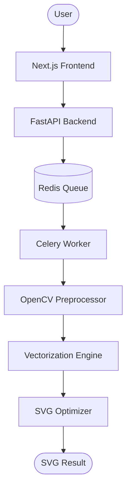
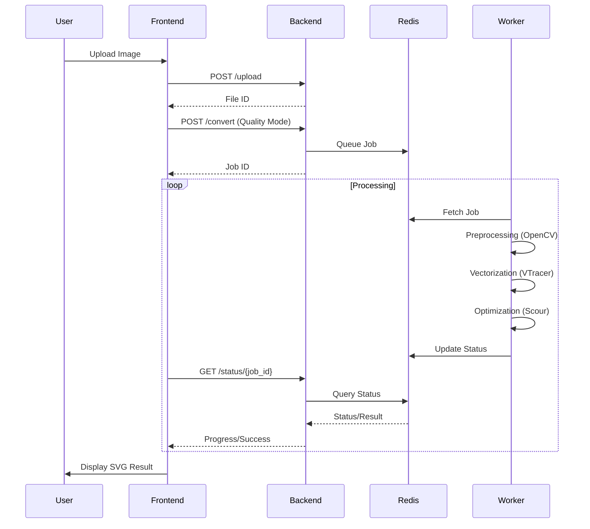

# Raster to SVG Converter

A production-grade raster-to-vector conversion platform with three quality tiers, advanced preprocessing, async processing, and a modern web interface.

## Features

### Quality Modes

| Mode | Preprocessing | SVG Optimization | Time | File Size | Best For |
|------|--------------|------------------|------|-----------|----------|
| **Fast** | None | Light | < 1s | 30-50KB | Simple graphics, clean images |
| **Standard** | Color reduction + Bilateral denoise + CLAHE | Standard | 1-3s | 20-40KB | Most images, photos |
| **High** | Standard + NLM + Sharpen + Edge enhancement | Aggressive | 3-10s | 15-30KB | Complex images, professional work |

### Advanced Preprocessing

- **Color Reduction**: K-means clustering, Median cut (8-256 colors)
- **Noise Reduction**: Gaussian, Bilateral, NLM, Median filters
- **Contrast Enhancement**: CLAHE, Histogram equalization, Levels, Sigmoid
- **Sharpening**: Unsharp mask, kernel-based
- **Edge Enhancement**: Laplacian, Sobel, Scharr operators
- **Monochrome Conversion**: Otsu, Adaptive, Manual thresholding
- **Dithering**: Floyd-Steinberg, Bayer, Atkinson, Ordered

### SVG Optimization

- **Light**: Remove metadata and comments
- **Standard**: Scour optimization (path simplification, ID shortening)
- **Aggressive**: Standard + color optimization + number rounding + minification

### Quality Analysis

- **Edge Preservation Score**: IoU between original and converted edges
- **SSIM**: Structural similarity index
- **MSE**: Mean squared error
- **PSNR**: Peak signal-to-noise ratio
- **Histogram Correlation**: Color distribution similarity
- **Quality Comparison**: Run all three modes and compare results

### Web Interface

- **Drag & Drop Upload**: Easy file upload with preview
- **Real-time Progress**: Track conversion progress live
- **Quality Selection**: Visual comparison of quality modes
- **History**: Persistent conversion history with search/filter
- **Responsive Design**: Works on desktop, tablet, and mobile

### API Features

- **Async Processing**: Celery workers for handling conversion jobs
- **Job Tracking**: Real-time status and progress via Redis
- **File Management**: Automatic cleanup and storage management
- **Batch Processing**: Convert multiple images in parallel
- **Quality Comparison**: API to compare all three quality modes
- **Recommendations**: AI-based quality mode recommendations

## Architecture

### System Flow



### Conversion Pipeline



## Quick Start

### Prerequisites

- Python 3.11+
- Node.js 18+
- Redis 7+

### Development Setup

```bash
# Clone repository
git clone https://github.com/mrigankad/RastertoSVG.git
cd RastertoSVG

# Setup Python environment
cd backend
python -m venv venv
source venv/bin/activate  # Windows: venv\Scripts\activate
pip install -r requirements.txt

cd ../frontend
npm install
```

### Run with Docker Compose

```bash
# Start all services
docker-compose up -d

# With monitoring (Prometheus, Grafana, Flower)
docker-compose --profile monitoring up -d
```

### Access Points

- **Frontend**: http://localhost:3000
- **API**: http://localhost:8000
- **API Docs**: http://localhost:8000/docs
- **Flower (Celery)**: http://localhost:5555
- **Prometheus**: http://localhost:9090
- **Grafana**: http://localhost:3001

## CLI Usage

```bash
# Convert single image
python -m backend.app.cli convert input.png -o output.svg --quality standard

# Batch convert
python -m backend.app.cli batch ./input-dir -o ./output-dir --quality standard

# Compare quality modes
python -m backend.app.cli compare input.png --output ./comparison

# Get quality recommendation
python -m backend.app.cli recommend input.png

# Preprocess only
python -m backend.app.cli preprocess input.png --output ./processed --quality high

# Apply dithering
python -m backend.app.cli dither input.png --output dithered.png --method atkinson

# Show info
python -m backend.app.cli info
```

## Deployment

### Docker Compose (Recommended for production)

```bash
# Copy production environment
cp backend/.env.production backend/.env

# Edit with your settings
nano backend/.env

# Deploy
docker-compose -f docker-compose.yml -f docker-compose.prod.yml up -d
```

### Kubernetes

```bash
# Create namespace
kubectl apply -f k8s/namespace.yaml

# Deploy all services
kubectl apply -f k8s/

# Scale workers
kubectl scale deployment worker --replicas=5 -n raster-svg
```

See [Deployment Guide](./docs/DEPLOYMENT.md) for detailed instructions.

## API Usage

### Python Client

```python
from examples.api_client import RasterToSVGClient

client = RasterToSVGClient("http://localhost:8000")

# Convert and wait
client.convert_and_wait("input.png", quality_mode="standard")

# Compare all quality modes
result = client.compare_all_modes("input.png")

# Get recommendation
recommendation = client.get_recommendation("input.png")
print(f"Recommended: {recommendation['recommended_mode']}")
```

### cURL

```bash
# Upload
curl -X POST -F "file=@input.png" http://localhost:8000/api/v1/upload

# Convert
curl -X POST -d "file_id=<file_id>&quality_mode=standard" \
  http://localhost:8000/api/v1/convert

# Check status
curl http://localhost:8000/api/v1/status/<job_id>

# Download
curl -o output.svg http://localhost:8000/api/v1/result/<job_id>
```

## API Endpoints

| Endpoint | Method | Description |
|----------|--------|-------------|
| `/upload` | POST | Upload image |
| `/convert` | POST | Start conversion |
| `/compare` | POST | Compare all quality modes |
| `/recommend` | POST | Get quality recommendation |
| `/status/{job_id}` | GET | Get job status |
| `/result/{job_id}` | GET | Download SVG |
| `/result/{job_id}/stats` | GET | Get result statistics |
| `/batch` | POST | Batch conversion |
| `/jobs` | GET | List jobs |
| `/storage/stats` | GET | Storage statistics |
| `/queue/stats` | GET | Queue statistics |

## Development Roadmap & Phases

The project was built in several structured phases. You can find the full roadmap, including completed milestones and future plans, in the [Phases Documentation](./docs/PHASES.md).

## Documentation

- [Development Phases & Roadmap](./docs/PHASES.md)
- [CLI Documentation](./docs/CLI.md)
- [API Documentation](./docs/API.md)
- [Architecture Overview](./docs/ARCHITECTURE.md)
- [Preprocessing Guide](./docs/PREPROCESSING.md)
- [Quality Modes](./docs/QUALITY_MODES.md)
- [Deployment Guide](./docs/DEPLOYMENT.md)
- [Project Completion Report](./docs/PROJECT_COMPLETION_REPORT.md)
- [Test Execution Summary](./docs/TEST_EXECUTION_SUMMARY.md)

## Examples

See the `examples/` directory:

- `convert_single.py` - Single image conversion
- `batch_convert.py` - Batch conversion
- `color_vs_bw.py` - Compare color vs monochrome modes
- `preprocess_comparison.py` - Compare preprocessing methods
- `dither_comparison.py` - Compare dithering algorithms
- `benchmark_preprocessing.py` - Benchmark performance
- `api_client.py` - Full API client example

## Testing

```bash
cd backend
pytest tests/ -v
```

## CI/CD

GitHub Actions workflow included for:
- Automated testing
- Security scanning
- Docker image building
- Deployment to staging/production

## Tech Stack

### Frontend
- Next.js 14 with App Router
- TypeScript
- Tailwind CSS
- Zustand (state management)
- Lucide React (icons)
- React Hot Toast (notifications)

### Backend
- FastAPI
- Celery + Redis
- Pillow + OpenCV + scikit-image
- VTracer + Potrace
- Scour (SVG optimization)

### Infrastructure
- Docker & Docker Compose
- Kubernetes manifests
- Prometheus + Grafana monitoring
- GitHub Actions CI/CD

## License

MIT

## Contributing

Contributions are welcome! Please read our contributing guidelines before submitting PRs.

## Support

For support, please open an issue on GitHub or contact the maintainers.

---

**Built with ❤️ for the open source community**
